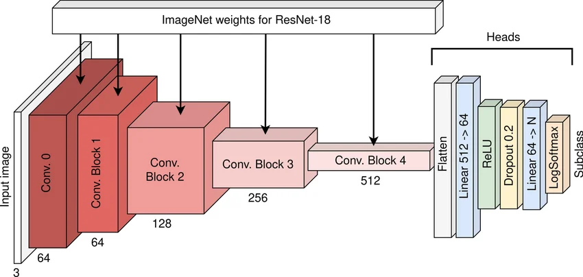

# Solar Filament Segmentation

Machine Learning project work, MSc Computer Engineering, University of Salerno
(A.Y. 2025/26).

**Author:** Francesco Peluso  
**Team:** `2026_MLrec_gr02`  
**Competition:** [Filament Segmentation 2026](https://www.kaggle.com/competitions/filament-segmentation-2026)

## Method

The task is binary segmentation of solar filaments in 2048 x 2048 grayscale images.
The submitted model is a U-Net with an ImageNet-pretrained ResNet18 encoder. The loss
is a balanced combination of binary cross-entropy and soft Dice loss. Images are split
into training and validation sets by file name, so annotations of the same observation
never cross the split.

The final checkpoint is experiment 13. On the validation split it obtained:

| Metric | Score |
| --- | ---: |
| Mean Dice | 0.676 |
| Panoptic Quality | 0.359 |

The model and inference recipe are selected using validation data. The unlabeled
competition test set is used only to generate the submission file.

<p>
  
  
</p>

The competition dataset is not included in the repository. It must be downloaded from
Kaggle and placed under `dataset/` using the competition folder structure.

## Reproducing the run

Install the dependencies:

```bash
python -m venv .venv
source .venv/bin/activate
pip install -r requirements.txt
```

For the final submission, use the notebooks prepared in the project:

1. run `notebooks/01_training.ipynb` in Google Colab with a GPU;
2. run `notebooks/02_inference.ipynb` to load the experiment 13 checkpoint and create
   `submission.csv`.

The training notebook records the configuration, validation metrics and checkpoint.
The inference notebook reads the saved operating-point recipe and does not tune on the
unlabeled test images.

## Project materials

The report sources and figures are in `docs/`. The final Moodle package is kept
separately and is intentionally excluded from this public repository.
